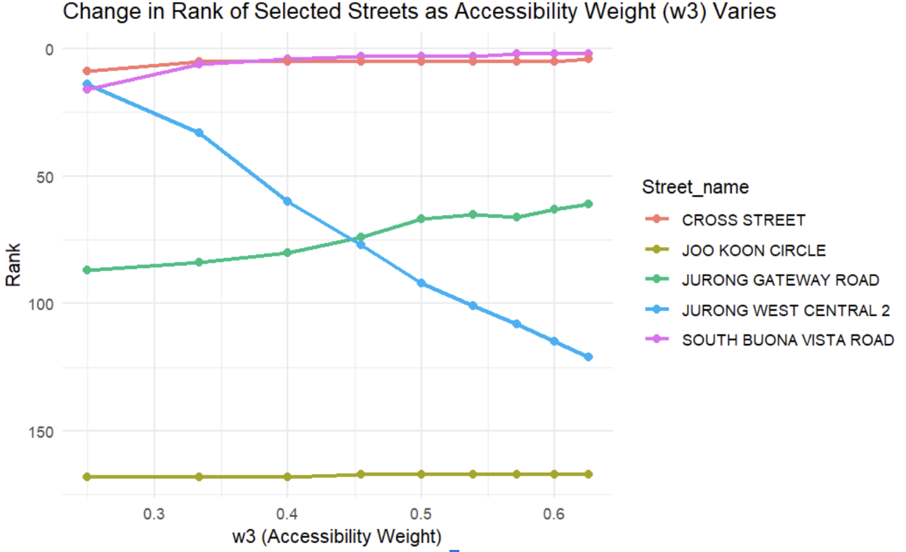

!(www/logo.png)

## Set Up Instructions

### Configuration
The API key for the LTA DataMall dataset should be stored in a local R script called api_keys.R where there is only one variable api_key = "your_key_here". Please create such an R script to store your own API key which will be referenced in the code where there is 'source("api_keys.R")'

### Running App 
Step 1: Clone Github Repository 
```bash
git clone https://github.com/melgann/dse-project.git 
cd dse-project 
```

Step 2: Install Necessary Packages to run Shiny App 

Step 3: Run App 


### Data Preparation

To ensure the app generates the most up-to-date scores, download the latest dataset and place it in the designated folder. Follow these steps:

**Step 1**: Ensure that the following Dependencies are installed in your local. 

##### R Package Requirements

```r
install.packages(c(
  "tidyverse","dplyr","data.table","jsonlite","sf","geosphere","dynlm","httr", 
  "rvest","fuzzyjoin","FactoMineR","factoextra", "readr", "readxl", "stringr", "lubridate"      
))

```

##### Python Package Requirements 
```bash
pip install pandas geopandas
````
**Step 2**: Download the Relevant Datasets 

##### Rental Prices 
To get the most current retail rental data:
1. Visit the [URA Retail Rental Analysis portal](https://eservice.ura.gov.sg/property-market-information/pmiCommercialRentalRetailAnalysis)
2. Select **"Retail"** under Commercial Rental Analysis
3. Choose the latest available quarter(s) for the current year
4. Download the dataset in CSV format
5. Save the file to `Raw_datasets`

##### Obtaining Coordinates for New Streets 
To get the coordinates for the newest streets 
1. Go to `Archive\Obtaining_coords_street.ipynb`
2. Update df_q1,df_q2,df_q3,df_q4
 
`
df_q1 = pd.read_csv("CommercialRentalStatsByStreet_YYYYMMDDHHMMSS.csv")  
`

4. Replace the `Bearer` to your own token by signing up to [OneMapApi](https://www.onemap.gov.sg/apidocs/register)
5. Execute cells 1-11 to obtain to new csv with the corresponding Planning Areas and Coordinates of the newly obtained Streets  

##### Public and Private Transport Timings 
1. Go to `Archive\Obtaining_coords_street.ipynb`
2. Replace the `Bearer` to your own token by signing up to [OneMapApi](https://www.onemap.gov.sg/apidocs/register) 
3.  Run code chunk 11 to the end of the file to obtain Public and Private Transport Timings of New Streets 


**Step 3**: Go to `backend_final_code.Rmd` and click `Run all` under `Run` to obtain the latest final scores with the updated datasets!


## 🧪 Methodology

### Objective  
To rank Singapore streets by retail potential based on accessibility, footfall, proximity to malls, and rental price. Scores are computed using derived geospatial and demographic variables.

---

### (A) Feature Engineering

#### 1. Distance to Nearest Mall  

#### 2. Rental Price  

#### 3. Captive Catchment Score  
- **Population**: Mapped street to planning area using spatial join.  
- **Schools**: Counted schools per planning area using `st_contains`.  
- **MRT Volume**: Found nearest MRT; computed weighted volume = (1/dist) × volume.  
- **Bus Volume**: Same method as MRT.

#### 4. Accessibility Score  
- **Inverted Distances of MRT**: 1 / distance to nearest MRT
-   **Inverted Distances of bus**: 1 / distance to nearest bus stop
- **MRT Count**: Counted stations within 250m.
- **Bus Count**: Counted bus stops within 250m
- **Travel Time Diff**: Weighted public–private travel time diff using population, then inverted.

---

### (B) Modelling

#### Assumptions  
- One vacant retail unit per street.  
- Distances are straight-line (using Haversine).  
- Relationships among variables are linear — the variation in the data can be captured using straight-line (linear) combinations of the variables

#### Scoring Formula  

#### PCA & Normalization  
- Applied PCA on catchment and accessibility variables.  
- Kept top 3 components (>98.9% for Captive Catchment Score and >79.8% variance explained for Accessibility Score).  
- Weighted sums normalized using min-max scaling.

#### Weights  
- **Default**: Based on survey % importance.  
- **Custom**: Based on user rank (1–10), normalized to sum to 1.

---

### (C) Evaluation

#### Why Not Traditional Metrics  
- No ground truth (e.g., store revenue), so accuracy metrics not applicable.

#### Sensitivity Analysis  
- Varying one weight (e.g., accessibility or rental) showed logical shifts in rankings.  
- Confirms the model responds meaningfully to priority changes.



We varied the Accessibility weight (w₃) from 2 to 10 while keeping all other weights fixed at 2. As w₃ increased, the ranks of more accessible streets (Cross Street, Jurong Gateway Rd, South Buona Vista Rd) rose, while those of less accessible streets (Jurong West Central 2, Joo Koon Circle) declined. This confirms that the model reacts intuitively to changing priorities.


